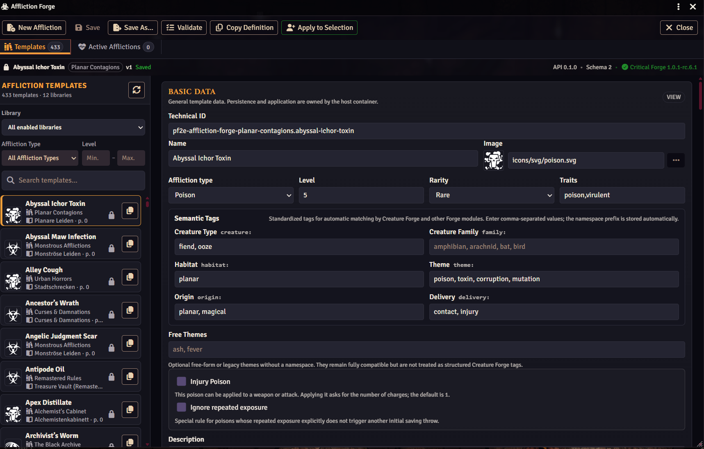
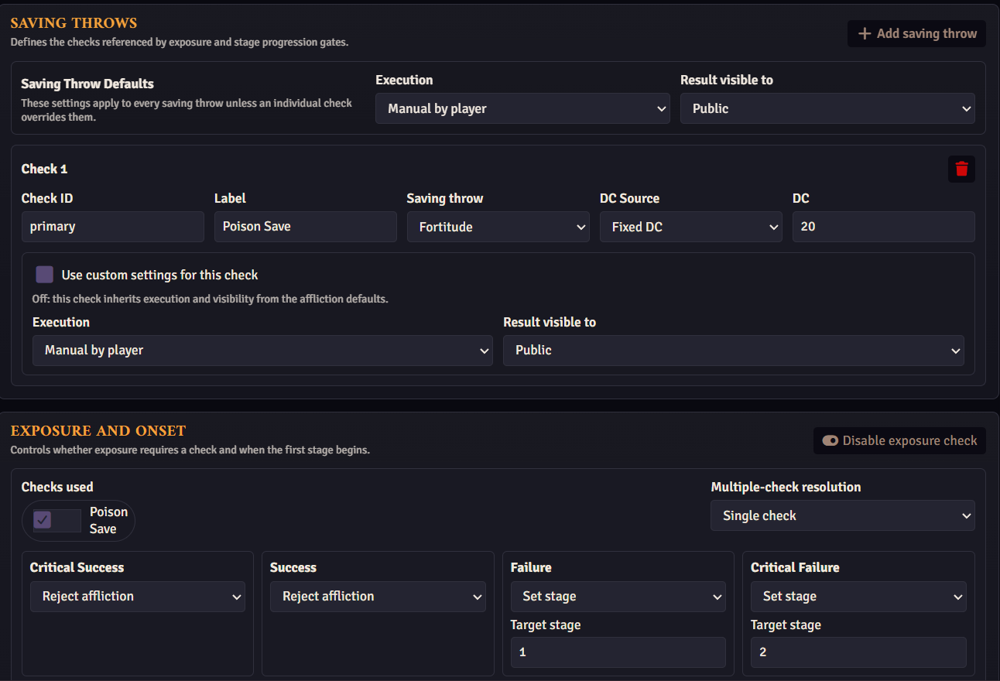
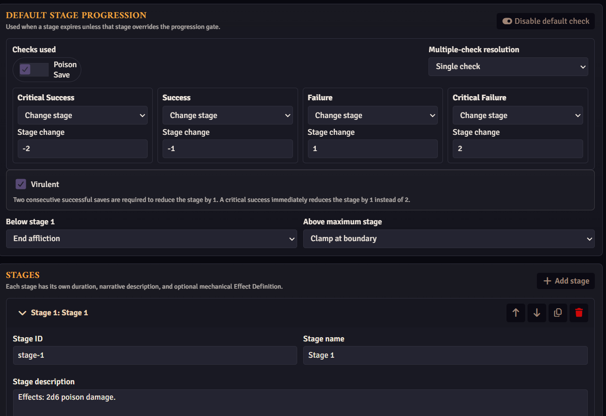
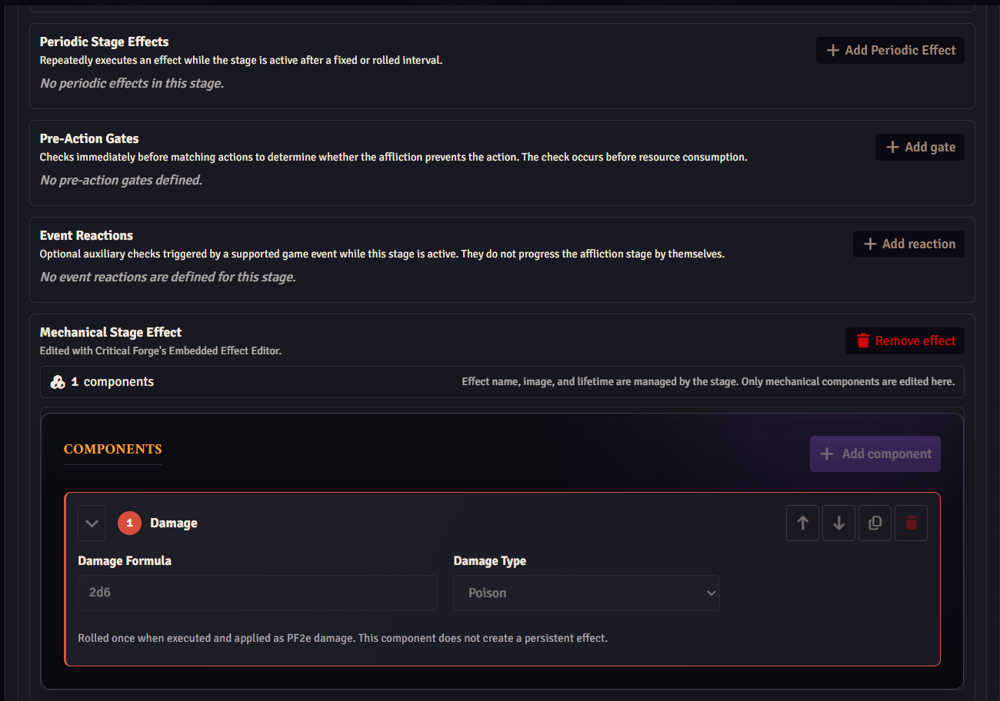

# Affliction Forge

**Affliction Forge** provides a complete framework for creating, managing, and running **poisons, diseases, curses, and other staged afflictions** in Pathfinder 2E for Foundry VTT.

Afflictions can include **initial exposure checks, onset periods, multiple stages, stage durations, recurring saving throws, recovery rules, persistent effects, periodic effects, restrictions, and lethal outcomes**. Their progression is tracked automatically using Foundry's world time, allowing long-running diseases and poisons to develop naturally without requiring the Game Master to manually remember every interval and saving throw.

The integrated **Affliction Editor** allows Game Masters to create their own reusable afflictions, while searchable libraries can provide additional content from world items, compendia, and external add-ons. Afflictions support different identification states, so their true nature can remain hidden or merely suspected until the characters discover what they are dealing with.

Affliction templates can also be linked directly to **weapons, attacks, abilities, feats, and spells**. Depending on their configuration, they can be applied manually, after confirmation, or automatically when appropriate PF2e events occur, such as a successful hit, applied damage, a failed saving throw, or use of an ability. Injury poisons can even be applied as limited-charge weapon coatings.

Stage mechanics are powered by the **Critical Forge Effect Engine**, allowing Affliction Forge to use the same flexible effect system for conditions, damage, modifiers, restrictions, healing interactions, death effects, and other mechanical consequences.

A public API, semantic tagging system, and provider libraries allow other Forge modules and content add-ons to create, reference, search, and apply afflictions without duplicating their progression logic.

**Affliction Forge requires Critical Forge.**

The **Affliction Forge** can be found here: https://github.com/crypto-vbrthr/pf2e-affliction-forge

**Affliction Forge is available on Foundry VTT's module repository.**

